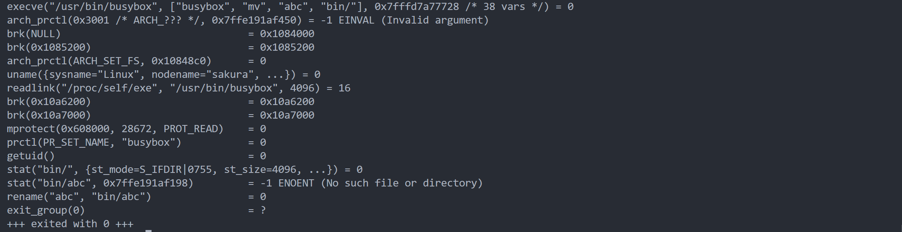
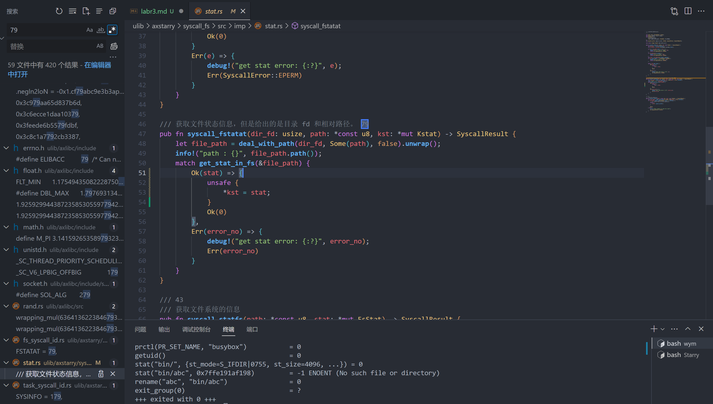
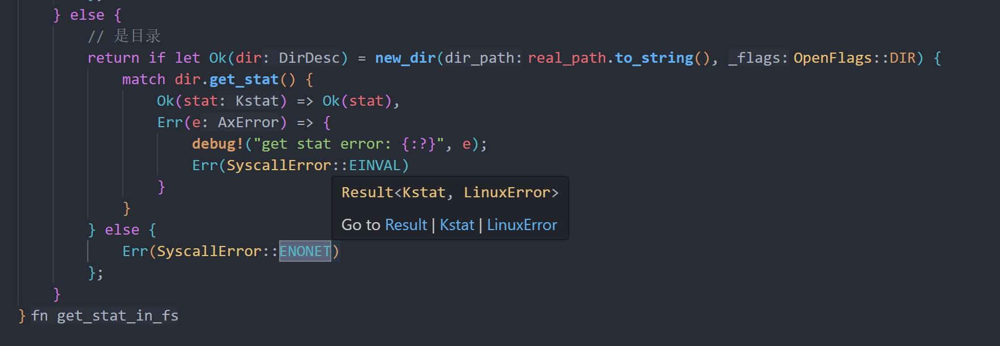
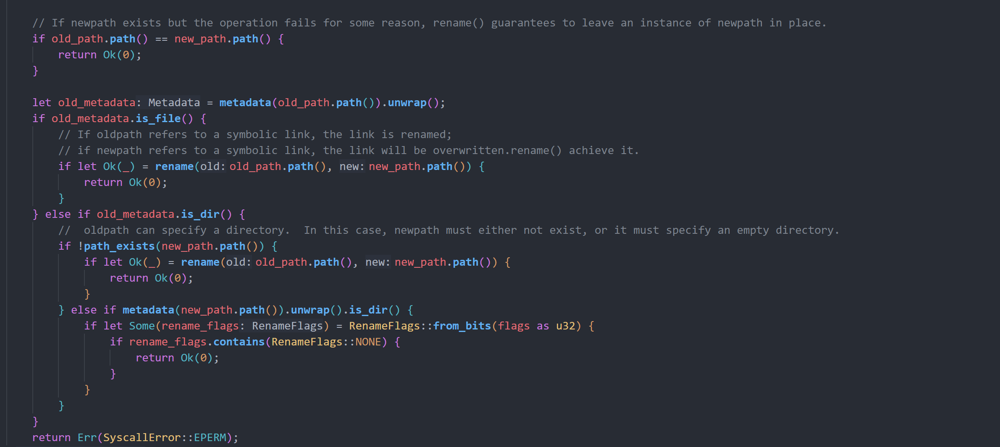
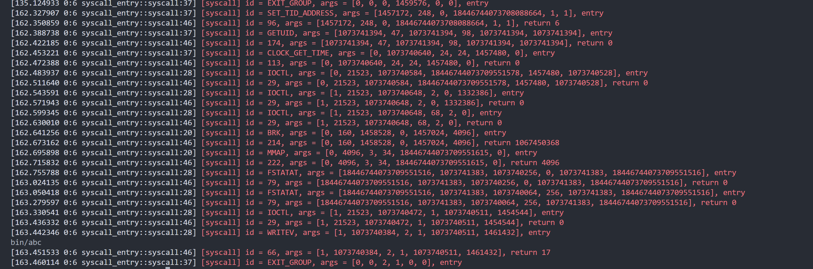
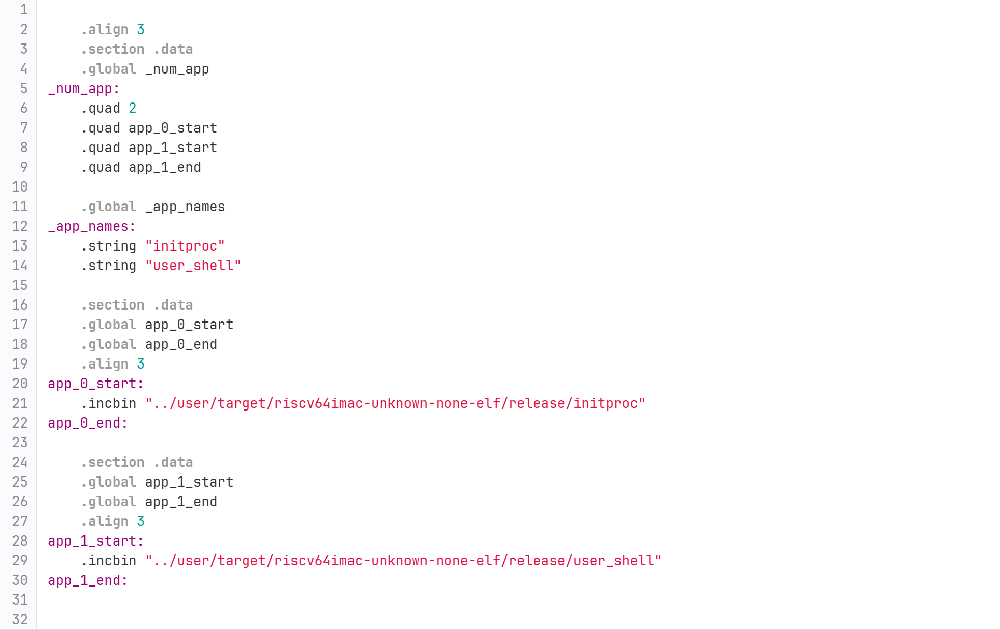
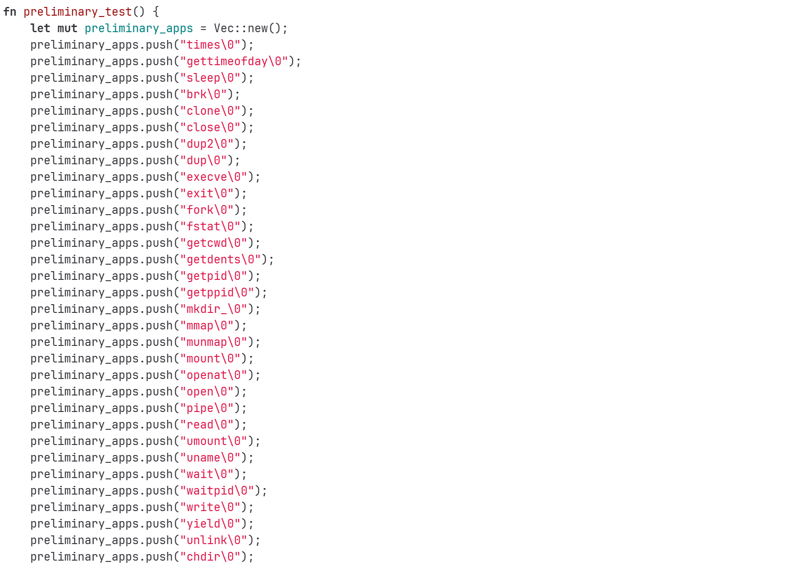

# 编程题
## 3.1

首先对拍，发现是fstatat的返回值错误，然后搜索
查看get_stat_in_fs（）
对照错误我们发现应该是将enoent写为了enonet

然后发现rename错了，然后一直跳转，找到了syscall_renameat2()

代码给出了最后的返回值err，我选择提前返回ok  
flag给了一个none，以及一堆函数，我没有多加flag，混合完成
  成功
## 3.2
这个就简单很多，原来是通过结尾是否带/来判断是否为文件，换成matedata的方法就好

# 问答题
## 1.1 

## 1.2 
如果你更新了项目的依赖但没有清理旧的编译输出，可能会出现版本冲突或其他依赖相关的问题  
有时候，旧的编译缓存或者增量编译文件可能会干扰新的构建过程，导致构建错误或不一致的结果
## 2.1
首先尝试看readme 文档没有找到 搜索找到了startapp.S

显然initproc是初始化，user_shell就是直接执行终端

在user_shell中可以发现执行了这些测试
## 3.1
不会，因为当发生出错或者主动使用sys_exi()后，我们无法在程序开头发现问题
## 3.2
不行，因为当使用sys_yield(),tarp可能会出错
